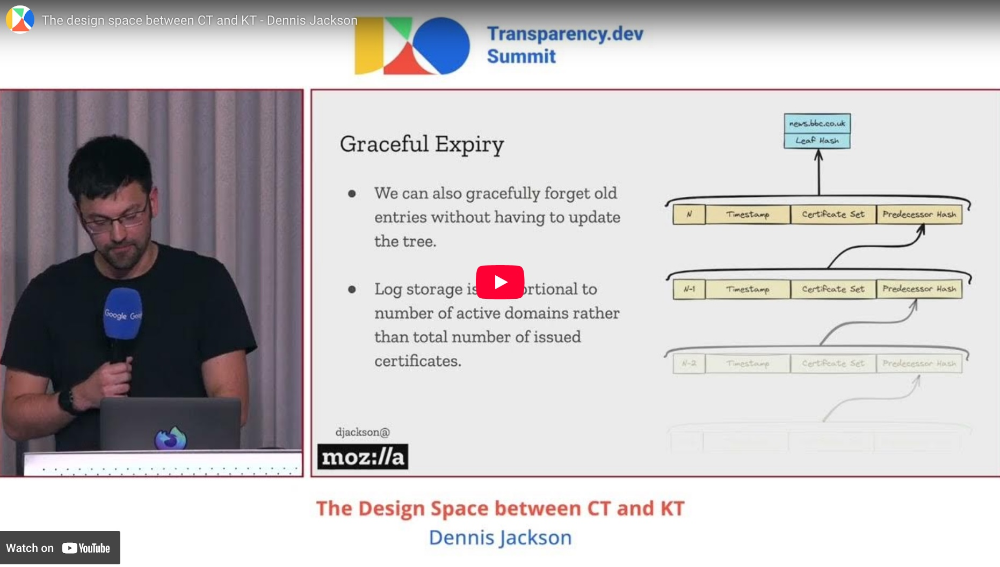

# Starlit Jellyfish

  

**Starlit Jellyfish** is a verifiable map. Unlike a traditional transparency log, it allows clients to look up entries by label (e.g. a domain name, software package, etc) and verify all entries for that label, without having to download the entire log. Clients can also receive a succinct proof of the most recent, unrevoked entry for a given label. This is similar to a Key Transparency log, but without KTs strong privacy requirements, enabling a much simpler and more efficient design.

Verifiable maps are a useful primitive for systems which want to provide a transparent view of both issuance and revocation, for example if a software package is known to have vulnerabilities, or a certificate has been compromised. They also offer significant bandwidth savings over traditional logs when clients are interested in only a small subset of entries, replacing an O(N) download with an O(log N) proof.

The initial [design](SPEC.md) emerged in April 2024 during discussions at HACS and RWC 2024. I presented a [lightning talk](https://www.youtube.com/watch?v=FRyNAer9SD8) at the 2024 Transparency.dev Summit outlining the concept and its motivation ([slides](2024-Transparency-Summit-Slides.pdf)):

## Name

**Starlit** references *Sunlight*, the original name for Certificate Transparency, and Filippo’s recent improvements. **Jellyfish** because the data structure used in this design resembles one.

## Acknowledgements

Special thanks to Kevin Lewi, Esha Ghosh, Brendan McMillion, Bas Westerbaan, Sophie Schmieg, Alexander Scheel, Richard Barnes, and Kevin Milner for many insightful conversations.
