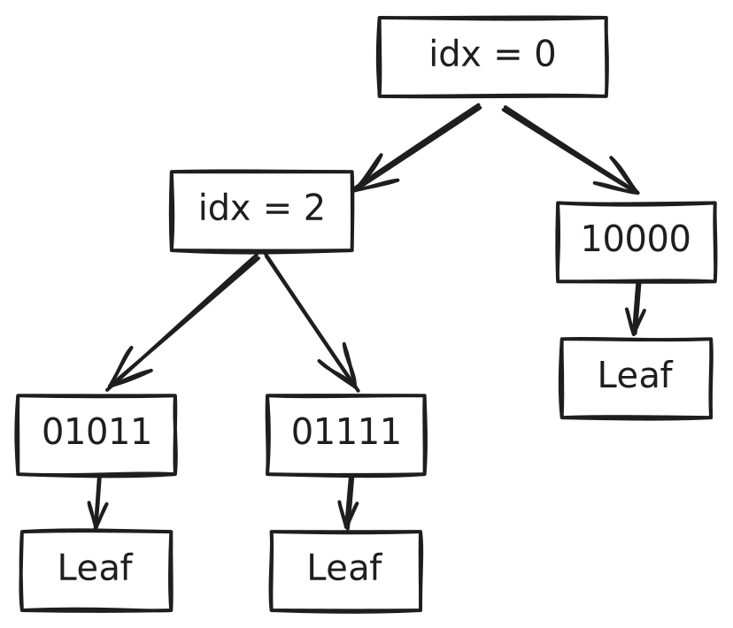

# The Starlit Jellyfish Data Structure

## Purpose

Transparency logs provide an append-only data structure whose operation is auditable: for any element in a transparency log, there is succinct proof that the element is included in the log.

Key Transparency logs provide stronger properties, in particular, they are verifiable maps which allow for succinct proofs that a particular key has a particular value, or that a key is not present in the log. The value of a particular key is also able to evolve over time. As well as these properties, Key Transparency logs typically imply some stronger privacy properties designed to protect the privacy of individual users and the system operator.

Starlit Jellyfish aims to provide a verifiable map without privacy, targeting simplicity and efficiency. By not targeting privacy, it's possible to achieve substantial savings over traditional Key Transparency designs.

Verifiable maps are attractive data structures because:

* They enable efficient revocation and transparent proof of (non-)revocation.
* They enable readers to monitor only a subset of keys that are interesting to them, without the overhead of having to download every entry.
* Their storage costs and proof lengths can be bounded by the number of unrevoked entries and does not grow indefinitely over time.

Starlit Jellyfish borrows ideas from the [SEEMless](https://eprint.iacr.org/2018/607.pdf), [Parakeet](https://scontent-man2-1.xx.fbcdn.net/v/t39.8562-6/329281407_5205768452859888_4104299861920434152_n.pdf?_nc_cat=100&ccb=1-7&_nc_sid=e280be&_nc_ohc=szrbNIZYLGsQ7kNvwFicbIK&_nc_oc=AdnaKLdx-ahR1d6j1NFd7gAOCYW4yY3V7YDPzULzJazW7-Kz448lTyLMMxBMnNC9TULUfrr5vDw1r-Qc4ISR3NuC&_nc_zt=14&_nc_ht=scontent-man2-1.xx&_nc_gid=kLU50SIlN-oCJ2hIfu2jcw&oh=00_AfS7wIiIrTsob23kp45Ws-GstsZP9uwfz8w0NE0u18BFNg&oe=6872E512) and [OPTIKS](https://www.usenix.org/conference/usenixsecurity24/presentation/len) family of Key Transparency designs.

## Preliminaries

This section reviews some well-known data structures which are used in the design.

### Hash Chain

Hash chains are a simple append-only structure. When a new element is added to the hash chain, it is inserted at the head. Each value commits to all the values that came before in the hash chain. This makes insertion cheap (O(1)) and ensures that the proof that the most recently inserted element is in the hash chain is constant length. However, inspecting elements further down the hash chain is linear in its age in the hash chain.

### Merkle History Tree

Merkle History Trees are also append-only. Unlike hash chains, they provide O(log N) proofs of inclusion for any element in the history tree. Inserting new elements requires updating elements on a log N sized frontier. In this diagram, the elements in green and brown represent the frontier.

### Sparse Merkle Tree

A Sparse Merkle Tree is a type of verifiable map. This diagram shows the map for the 2-bit keyspace `00,01,10,11`. A naive sparse merkle tree has proof lengths proportional to the number of bits in the keyspace. A proof of inclusion works similarly to a merkle history tree. A proof of non-inclusion can also be made by showing that the value in question is an empty-placeholder.

### Merkle Patricia Trie

A Merkle Patricia Tree is an optimized variant of a Sparse Merkle Tree.

Instead of representing the full keyspace as nodes of the tree, an MPT compresses paths where no nodes are present. It does this by storing an index with each interior node which indicates the bit-position in the key which this node governs. For example, in the preceding diagram, the root node governs the first bit in the key (0 or 1). All left children of the root node have a key beginning 0 and all children, a key beginning 1. The node `idx = 2` governs the bit in the third position. This path compression allows MPT to offer proof lengths proportional to the number of elements in the map, rather than the keyspace as in a Sparse Merkle Tree.

This diagram shows the result of updating the preceding MPT with the new key `01110` and its associated value. The interior node in red has been inserted. Its index indicates the bit position at which the new key and its neighbor differ. The interior nodes listed in green have been updated as a result of the insertion. Merkle Patricia Trees have the property for that for every key-value pair, there is one interior node.

## Design

Starlit Jellyfish begins with Merkle Patricia Tree. The keys of the MPT are the keys of the map. The leaf values of the MPT are the heads of hash chains. This allows the MPT structure to provide an efficient proof of the current value of each key-value pair in the map. It is also possible to prove the history of each key, in size linear to the size of the requested history. This structure is sketched below:

Insertion into this structure is a two-step process:

 1. Read the current head of the hash chain and generate a new head which includes the new leaf value.
 2. Insert the new head of the hash chain into the MPT, updating the log N nodes between the leaf and the root.

Over time, the map can delete old entries by deleting older values in the leaf hash chains. This doesn't require any changes to any nodes other than those being deleted.

### Key Structure

Key Transparency logs mask their keys with Verifiable Random Functions (VRFs) to provide strong privacy properties. These are unnecessary in the context of publicly verifiable maps.
The simplest formulation is to simply hash (e.g. SHA-256) each leaf before inserting it in the tree. This provides a simple form of balancing for the MPT structure. If
the key values are hierarchical (e.g. Domains, Java Package Names), then this structure can be reflected in the tree. The key should be structured with the top of the hierarchy first and each individual component hashed and concatenated.

For example, inserting the key `www.example.co.uk`, could be stored as `H(uk.co.example) || H(www)`. A structured key of this form will result in longer proof lengths on average, but provide isolation between different key prefixes. That is, no matter how many subdomains of `example.co.uk` are inserted in the log, it only impacts the proof lengths for other subdomains of `example.co.uk` and has no impact on the proof lengths for other domains.

### Revocation and Multi-Value leaves

In many contexts, there may be multiple values which are valid for a given key. For example, a given domain may not have a single valid certificate, it might have many. This can be handled by representing the values as a Merkle History Tree and storing the head of that tree in the value of the hash chain. This means that adding new values to the key becomes inserting new values in the tree, then updating the hash chain and the MPT. Removing values works similarly. This maintains the invariant that the valid unrevoked values are stored at the top of the hash chain, with older entries in the hash chain indicating expired or revoked entries.

### Client API

#### `Submit(key,value)`

A higher level application will typically want to make a decision about authorization before adding to the log, e.g. proving ownership of the identifier that `key` is associated with and that `value` is well-formed.

The log operator will likely want to batch submitted entries together and merge them into the tree. Batching allows for more efficient updates, as changes to the higher levels of the tree will overlap, leading to the writes being merged.

Updating the tree requires reading the path from the root of the tree to the relevant leaf nodes from the log's underlying storage, then calculating the new nodes that need to be written and writing them out as a single batch. In detail:

1. Read the Merkle History Tree at the head of hash chain at the leaf of Merkle Patricia Tree for the corresponding key.
2. Insert a new node into the MHT. Insert a new node into the hash chain.
3. Update the path from the MPT leaf to the root.

The total number of nodes changed is the single new node at the head of the hash chain and the path back to the root of the MPT.

#### `Revoke(key,value)`

The same considerations apply as for Submit, however, this time a node is being removed from the Merkle History Tree. It's straightforward to batch together both submissions and revocations.

#### `GetCurrent(key) -> Value, Proof`

This returns the current or values stored at the leaf. The proof is composed of a proof of inclusion in the MPT up to the root, plus one or more signatures on the root hash, plus the hash of the rest of the hash chain stored at the leaf.
The proof will typically be `log(K) + log(SK)` sized where `K` is the number of top-level keys in the map and `SK` is the number of keys in the sub-tree for this part of the keyspace. For the earlier example, this translates to `log(eTLDs)` in the log plus `log(subdomains)` of the website in question.

#### `GetHistory(key, age) -> Values, Proof`

Age defines how many entries the log should provide. It might be represented as a number of epochs, a timestamp, or some other criteria. `Proof` is the size same as for `GetCurrent`, the only difference is multiple values are returned.

## Trust Model

This design doesn't enable individual clients to monitor the overall integrity of the tree (although it could be extended to support this). Instead, it relies on witnesses to monitor the tree and provide a signature on the tree head if they are satisfied the tree has been correctly constructed. Clients must trust at least one of the witnesses who signed the tree head.

In return, a proof of inclusion and non-revocation in the map is extremely succinct and typically `log(N)` sized for a map of `N` active key-value pairs, plus the overhead of witness signatures.

## Witnessing

Witnesses, depending on their capability, could adopt different deployment models:

* **Full Mirror** - The witness maintains their own view of the log. They receive a batch of updates describing changes to the log since their last signature, compute the new head, and produce a signature on that.
* **Stateless Mirror** - The witness receives a 'frontier' of the old log and their own signature on the head. The witness receives a batch describing the changes to the log and similarly computes the new head.
* **Lightweight** - The witness only receives the new head of the log and logs it in their own append-only log. The log is responsible for serving audit files which allow the tree to be rebuilt at each witnessed head.

Full witnesses require similar hardware to the log itself in order to keep up as they must process every key-value pair added/removed from the log. Lightweight witnesses instead have much lighter costs, but raise the possibility that some entries are (detectably) lost in the event of log misbehavior.

## Performance and Implementation

Meta have already deployed their key transparency system ([akd](https://github.com/facebook/akd/)) for ~3 billion WhatsApp users. Starlit Jellyfish uses a similar data structure but is substantially more efficient, requiring a smaller tree and roughly 1 / 3 of the storage operations of akd.

Unlike a Static CT log, Starlit Jellyfish is not an append-only data structure and requires an underlying key-value store rather than flat files.

TODO: Describe tick-tock architecture

TODO: Describe durability and consistency requirements.

